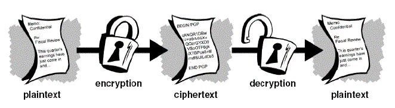
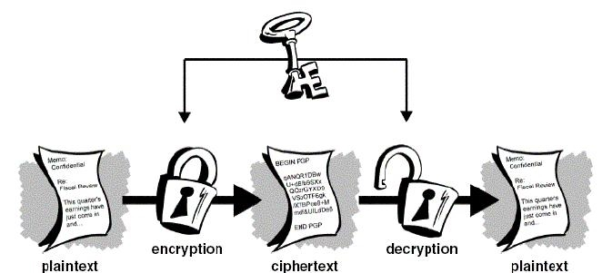
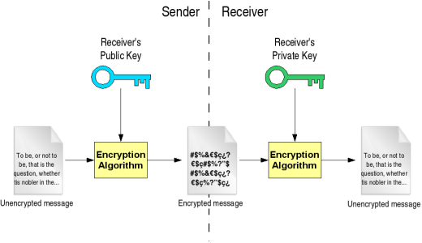

class: center, middle

# Cryptography and Security

## How to keep your data safe (a bit)

### Chris Wilson, [Aptivate](http://www.aptivate.org/), AfNOG 2014

---

## Credits

Based on presentations by:

* [Marcus Adomey](http://www.afnog.org/afnog_chix2011/Thursday/MA/CryptographySlides.odp) (AfChix, Malawi, 2011)
* [NSRC](https://nsrc.org/workshops/2013/nsrc-tenet-tut/raw-attachment/wiki/AgendaTrack2) (NSRC-TENET Workshop, South Africa, 2013)

You can access this presentation at: http://afnog.github.io/sse/crypto/presentation

Download or edit this presentation [on GitHub](https://github.com/afnog/sse/crypto/presentation.md).

---

## What we can talk about

* What is security? (theory)
* What is cryptography? (theory)
* Public and private key crypto
* Hash functions
* Generating SSL certificates
* Running a mini Certificate Authority
* Practical exercises

---

## What do you care about?

What is security?

--

* Trying to prevent some particular event.

What do you want to prevent? What is the **threat**?

--

* Is your data valuable to someone else?
* Are your systems valuable to someone else?
* Can someone cause expensive damage (e.g. death)?
* What prevents them from doing that?

???

* Is your data valuable to someone else?
  * Sell it?
  * Blackmail?
  * Steal money or resources?
  * Embarrass somebody important?
  * Threaten to or actually cause downtime?
* Are your systems valuable to someone else?
  * CPU time?
  * Disk space?
  * Network bandwidth?
  * IP addresses?
  * Access to other systems?
* What prevents them from doing that? - brainstorm

---

## Examples of security measures

Make a list of measures that you actually use.

--

For example:

* Locks on doors
* Security lights
* Video cameras
* Passwords
* Dual signatures
* Thumb prints
* Credit card PIN
* Credit limits

---

## How secure are you?

How would you crack the defensive measures that we just listed?

---

## Absolute security

> The only truly secure system is one that is powered off, cast in a block of concrete and sealed in a lead-lined room with armed guards - and even then I have my doubts. - [Gene Spafford](http://spaf.cerias.purdue.edu/quotes.html)

Security is **impossible** if:

* some users have additional rights (privileges)
* AND you cannot distinguish users using only laws of physics
* OR you cannot make it physically impossible to violate policy

---

## Living with insecurity

* **Can't** be completely secure
* **Can** make individual attacks:
  * More expensive
  * More risky
  * Less rewarding
* Beware the side effects (systems harder to use)
* Increase transparency
  * more eyes on attackers
  * more understanding of what security means

---

## Reducing specific risks

* Use encrypted communications
* Use multi-factor authentication
* Verify authenticity of messages
* Reduce risks (don't keep sensitive data)
* Increase risks for attackers (monitoring and logging)

---

## Goals of system security

Why do you lock your doors?

* Confidentiality
* Integrity
* Authentication
  * Access Control
  * Verification
  * Non-repudiation
* Availability

---

### Confidentiality (secrecy)

--

* Ensuring that no one can read the message except the intended receiver.
* Data is kept secret from those without the proper credentials, even if that data travels through an insecure medium.
* How does this prevent 

---

### Integrity (anti-tampering)

--

* Assuring the receiver that the received message has not been altered in any way from the original.
* Preventing unauthorised or undetected changes to the protected system.

---

### Authentication

--

* The process of proving one's identity.
  * The primary forms of host-to-host authentication on the Internet today are name-based or address-based, both of which are notoriously weak.
* Cryptography can help establish identity for authentication purposes (how?)

--

  * Can prove that you possess a secret
  * Or that you spent a LOT of energy to brute-force it

---

### Non-repudiation

--

* A mechanism to prove that the sender really sent this message

---

## How do we use cryptography?

* ssh/scp/sftp
* SSL/TLS/https
* pops/imaps/smtps
* VPNs
* dnssec
* wep/wpa
* digital signatures (software)
* certificates and pki
* DRM
* disk encryption

---

## Applied Cryptography

Written by Bruce Schneier. Perhaps the best book around if you
want to understand how cryptography works.

https://www.schneier.com/book-applied.html

---

class: small

## Cryptographic Tools

* hashes/message digests
  * MD5, SHA1, SHA256, SHA512
  * collisions
* entropy (randomness)
* keys
  * symmetric/asymmetric (public/private)
  * length
  * creation
  * distribution
* ciphers
  * block/stream
  * AES, 3DES, Blowfish, IDEA
* plaintext/ciphertext
* password/passphrase

---

## Ciphers &rarr; Ciphertext

The foundation of all of cryptography:

* We start with *plaintext*. Something you can read.
* We apply a mathematical algorithm (*cipher*) to it.
* The plaintext is turned in to *ciphertext*.
* Almost all ciphers were secret until recently.
* Creating a secure cipher is HARD.

---

## Symmetric Ciphers (Conventional)

**The same key** is used to encrypt the document before
sending and to decrypt it once it is received.

* Lost key = compromised/lost data
* This type of cipher system is efficient for large amounts of data
* Most are relatively simple to understand and implement

Examples:

* DES and 3DES (56/112 bits, 1977+)
* AES (128-256 bits,
* IDEA (128 bit, 1991, patented?)

---

## Problems with Conventional Cryptography

### Key Management

* How to get the same key to all users without risk of compromise?
* This is why the “Public Key Cryptography” came into existence.

---

## Public Key Cryptography

**Different related keys** are used to encrypt the document before
sending and to decrypt it once it is received.

* Usually one key is public and the other private
  * Anyone &rarr; private key holder (confidentiality)
  * Private key holder &rarr; anyone (integrity)
* Examples: RSA, DSA

---

## Problems with Public Key Crypto

* Inefficient for large amounts of data
* Possible to brute-force the private key for a public key
* Theoretically possible to convert a public key back to private

Solutions?

--

* Use public key crypto to encrypt the secret used to encrypt document
* Longer keys are harder to brute-force (e.g. 2048 bits, 4096 bits)
  * Notice how long these are compared to symmetric cipher keys!
* Use a well-designed (unbroken) algorithm

---

## Hash Functions

Algorithms that take any amount of input and return a fixed-size output string,
which is called the hash value or **hash**.

---

## Ideal hash function

* it is easy to compute the hash value for any given message
* it is infeasible to find a message that has a given hash
* it is infeasible to modify a message without changing its hash
* it is infeasible to find two different messages with the same hash

A hash function that maps each valid input to a different hash value is said
to be *perfect*.

---

## Hash Exercise

Example hash function:

* Add up all the letters and digits in the message (A=1, B=2, etc)

The exercise:

* Write a short message to a partner
* Compute the hash
* Give the message and hash to your partner to verify
* Verify the message from your partner

---

## Hash Analysis

Does this hash function meet our ideal properties?

1. it is easy to compute the hash value for any given message
2. it is infeasible to find a message that has a given hash
3. it is infeasible to modify a message without changing its hash
4. it is infeasible to find two different messages with the same hash

---

## Hash Analysis

Not really!

1. Easy to compute.
2. Easy to find another message with the same hash (string of 1s)
3. Easy to modify a message without changing its hash (rearrange the letters)

---

## Hashes in real life

[ftp://ftp.freebsd.org/pub/FreeBSD/releases/i386/i386/ISO-IMAGES/10.0/](ftp://ftp.freebsd.org/pub/FreeBSD/releases/i386/i386/ISO-IMAGES/10.0/)

* Look at the `CHECKSUM.MD5` and `CHECKSUM.SHA256` files.
* What do they tell you?
--

The checksums of the large binary files in that directory.

* Do you actually need to download this file from `ftp.freebsd.org`?
* How would you check that your download is complete and not corrupt?

---

## Hash practical 1

<pre>
fetch http://mini1.sse.ws.afnog.org/~inst/FreeBSD-10.0-RELEASE-i386-bootonly.iso
md5 FreeBSD-10.0-RELEASE-i386-bootonly.iso
sha256 FreeBSD-10.0-RELEASE-i386-bootonly.iso
</pre>

* Does it match?
* Why would you do this?
* What speed did you get?

---

## Hash practical 2

* Write a message to your partner in a text file.
* Use the `sha256` command to generate a signature for the file.
* Use `scp` to copy the file to your partner's computer:

<pre>
scp mymessage.txt afnog@pcYY.sse.ws.afnog.org:/tmp
</pre>

* Tell your partner the first four letters of the 
  * With a good hash function, it's reasonably safe to compare just the first
    few characters.

---

## FIN

Any questions?
